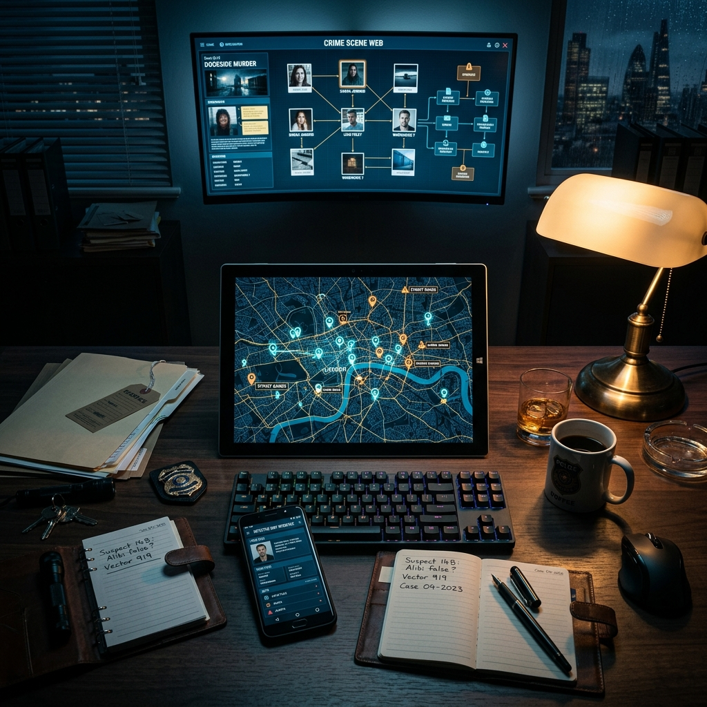

# 🕵️‍♂️ Investigação RPG: Hybrid VTT



> **Uma experiência de RPG de mesa híbrida onde a estratégia encontra a tecnologia.**

Este é um sistema de **Virtual Tabletop (VTT) Híbrido** projetado para sessões presenciais. O jogo utiliza uma arquitetura de **"Tela Única"** (TV ou Monitor) para exibir o tabuleiro global, enquanto os jogadores interagem de forma privada e confidencial através de seus dispositivos móveis.

---

## ✨ Características Principais

*   **📺 View do Tabuleiro (TV):** Uma interface cinematográfica que exibe o mapa da cidade, movimentação em tempo real e revelação de pistas.
*   **📱 View do Jogador (Mobile):** Cada jogador possui seu próprio "terminal de investigação" para gerenciar inventário, gastar Pontos de Investigação (PI) e realizar ações secretas.
*   **🤖 IA Master (LangChain):** Uma inteligência artificial que atua como narradora e validadora, transformando a logística do crime em evidências narrativas estruturadas.
*   **⚡ Sincronismo Instantâneo:** Comunicação via WebSockets (Django Channels) garante que cada ação no celular reflita imediatamente na tela principal.
*   **🗺️ Mapas SVG Interativos:** Mapas vetoriais dinâmicos com "névoa de guerra" e animações fluidas via Framer Motion.
*   **🔗 Entrada via QR Code:** Jogadores entram na partida instantaneamente escaneando um código gerado na tela principal.

---

## 🏗️ Arquitetura e Tecnologias

O projeto é construído com uma stack moderna focada em performance e tempo real:

### Backend (O Cérebro)
*   **Framework:** Django REST Framework (DRF)
*   **Real-Time:** Django Channels & Redis
*   **IA:** LangChain + Pydantic/Instructor (Dados estruturados)
*   **Banco de Dados:** PostgreSQL

### Frontend (A Experiência)
*   **Framework:** React + Vite + TypeScript
*   **Estilização:** Vanilla CSS (Moderno/Aesthetic)
*   **Animações:** Framer Motion
*   **Estado Global:** Zustand & TanStack Query

### Infraestrutura
*   **Containerização:** Docker & Docker Compose
*   **Servidor ASGI:** Daphne

---

## 🚀 Como Executar

Certifique-se de ter o **Docker** e o **Docker Compose** instalados.

1.  **Clone o repositório:**
    ```bash
    git clone https://github.com/seu-usuario/investigacao-rpg.git
    cd investigacao-rpg
    ```

2.  **Inicie os containers:**
    ```bash
    docker-compose up --build
    ```

3.  **Acesse as interfaces:**
    *   **Dashboard da TV:** `http://localhost:5173/tv`
    *   **Interface do Jogador:** `http://localhost:5173/player`
    *   **API Admin:** `http://localhost:8000/admin`

---

## 📂 Estrutura do Projeto

```text
root/
├── backend/            # Lógica de negócio, API e WebSockets (Django)
├── frontend/           # Interfaces Web e Mobile (React/Vite)
├── docs/               # Documentação técnica detalhada
└── docker-compose.yml  # Orquestração dos serviços (App, DB, Redis)
```

---

## 🛠️ Desenvolvimento

Para detalhes sobre os padrões de código, fluxos de eventos e guia de contribuição, consulte a pasta [docs/](docs/):
- [Guia de Arquitetura](docs/architecture.md)
- [Stack Tecnológica](docs/stack.md)
- [Guia do Desenvolvedor IA](docs/AI_DEVELOPER_GUIDE.md)

---

## 📄 Licença

Este projeto está sob a licença MIT. Veja o arquivo [LICENSE](LICENSE) para detalhes.

---
*Desenvolvido para elevar o nível das sessões de RPG de investigação.*
